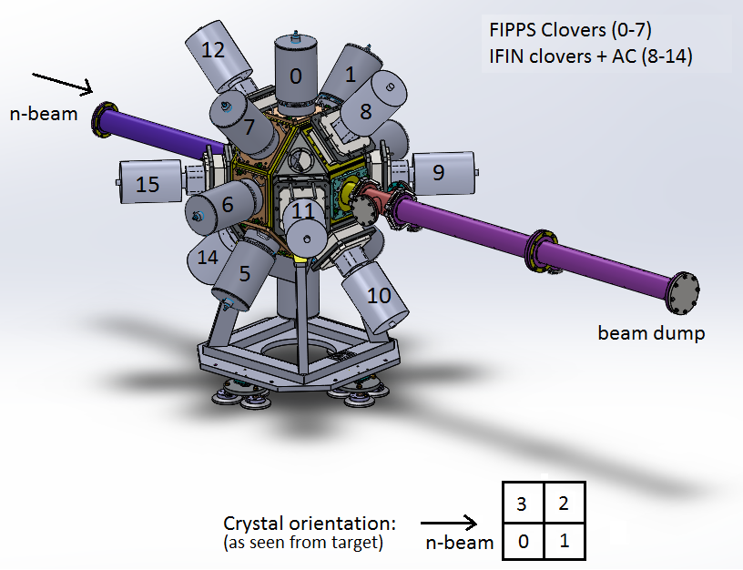

# Config Files

## XPConfig.txt

Each row represents a detector indexed by the first column. Holds information relating to energy calibration, detector type, energy range, and so on. This file is most commonly used in scripts  with `TXPConfig`'s constructor:

`TXPConfig XPConfig = new TXPConfig( "./XPConfigs/XPConfig.txt" );`

## XPGeometry.txt
XPGeometry translates index numbers into detector numbers.

Contains information about the specific geometry of the array as related to the index number from XPConfig. This allows to translate the index to a physical detector, and crystal position. Geometry information for detector positions is hard coded into TXPConfig.

<<<<<<< HEAD

=======

>>>>>>> 5ed2999daa51a2834ae3e7214d6f5e6dc3ad84ee
TODO: Add axis information which matches implimentation in `TXPConfig`.

Ex,

index | clover | crystal
----- | ------ | -------
0     | 8      | 0
1     | 8      | 1
2     | 8      | 2
3     | 8      | 3
4     | 8      | -1

Is a table for clover 3 with a BGO shield.

XPGeometry can be loaded in with `XPConfig->loadGeometry("./XPGeometry.txt");`
